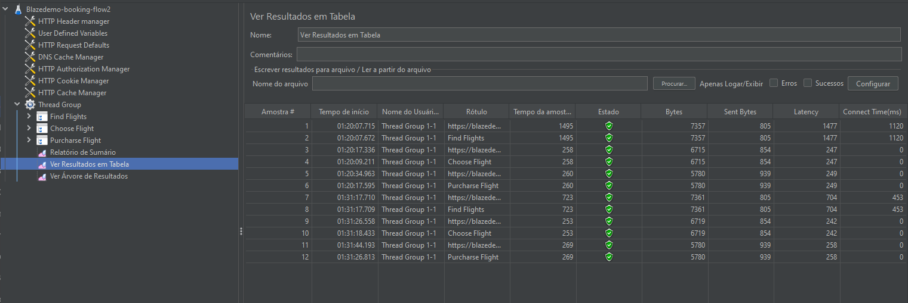

# BlazeDemo Performance Test

Projeto de testes de performance executado no site de demonstração **BlazeDemo** (simulação de reserva de passagens aéreas).

O objetivo foi validar o comportamento da aplicação sob carga e garantir a integridade do fluxo de reserva (Booking Flight).

## Tecnologias Utilizadas
- **JMeter 5.6:** Para orquestração e execução dos testes de carga.
- **Blazemeter Plugin:** Para gravação inicial do cenário e captura de requisições.
- **Java:** Ambiente de execução.

## Cenário de Teste (Script)
O script `blazedemo_booking_flow.jmx` cobre o seguinte fluxo End-to-End:
1.  **Home Page:** Acesso à página inicial.
2.  **Find Flights:** Busca de voos entre cidades (Ex: Paris -> Buenos Aires).
3.  **Choose Flight:** Seleção do primeiro voo da lista.
4.  **Purchase Flight:** Preenchimento do formulário de passageiro.
5.  **Confirmation:** Validação da página de "Obrigado" (Asserção de Texto).

## Resultados e Evidências
O teste foi executado com sucesso validando os critérios de aceitação (HTTP 200 e Presença de texto de confirmação).

## Como executar este projeto
1. Tenha o **JMeter** instalado.
2. Clone este repositório.
3. Abra o JMeter > File > Open > Selecione `tests/blazedemo_booking_flow.jmx`.
4. Clique no botão **Run** (Play).
